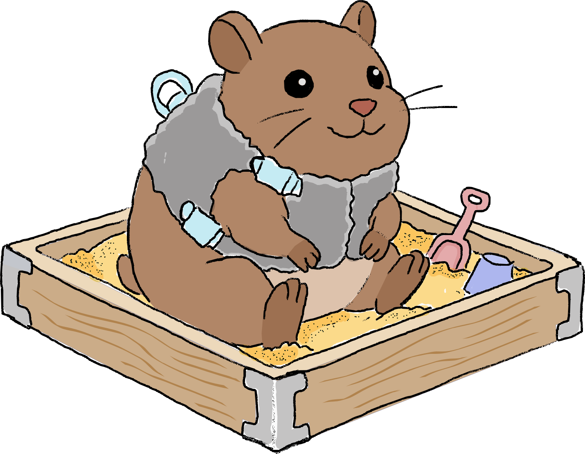

# gerbil

:warning: work-in-progress, but fairly stable :warning:



A sandboxed agent for Lean projects. gerbil sessions run in a
container (Docker or podman) and produce git patches.

```console
$ gerbil run --model claude-opus-4-8 \
             --fill-sorry Hello.Basic.myLemma
...
$ gerbil commit
$ git push
```


By default, gerbil shows you a live view inside the container. Press `d`
to detach it and let gerbil continue in the background.

You can see running gerbils and jump back into the live view at any moment:
```console
$ gerbil ps
NAME       STATUS   PROJECT    MODEL  SESSION                  TURNS  CTX  ELAPSED
coral-jay  running  MyProject  ...    gerbil-260814-114341-04  72     13%  01:20:52

$ gerbil grab coral-jay   # re-open live view
```

## Install

`gerbil` is a single self-contained launcher script. Put it on your `PATH`; it
fetches its own source from GitHub on first use. Requires `git`,
[`uv`](https://astral.sh/uv), and `docker` (or `podman`).

```console
curl -fsSL https://raw.githubusercontent.com/shwestrick/gerbil/main/bin/gerbil \
     -o ~/.local/bin/gerbil && chmod +x ~/.local/bin/gerbil
```

The sandbox image is built automatically on the first `gerbil run`. Later,
`gerbil update` updates gerbil and rebuilds the image.

More: [Installation](docs/install.md)

## Use

Run at your Lake project root, in a git repo with a clean working tree.

```console
$ cd /path/to/my/lake/project

$ export ANTHROPIC_API_KEY=...

$ gerbil run --model claude-opus-4-8 --fill-sorry Foo.Bar.lemma
...
--- 139 turns, 17,742,881 tokens (in: 277 + 17,114,370 cache-read + 494,976 cache-write, out: 133,258), ~$14.9836 ---
session: /Users/shwestrick/.gerbil/sessions/gerbil-260722-171419.jsonl
patch:   /path/to/my/lake/project/.gerbil/gerbil-260722-171419.patch (git am)
```

Each session produces a `.jsonl` log of everything that happened and a `.patch`
holding the work. Nothing touches your repo until you apply it:

```console
$ gerbil commit
$ git push
```

gerbil works best at filling a `sorry`, but has other functionality as well.
See more documentation below.

## Documentation

- [Installation](docs/install.md) -- installing and updating, Docker vs. podman,
  `~/.gerbil`
- [Models and API keys](docs/models.md) -- providers, local models via ollama,
  Portkey gateways
- [Workflow](docs/workflow.md) -- prompt, patch, commit, etc.
- [Filling sorries](docs/fill-sorry.md) -- `--fill-sorry` and `gerbil
  new-fill`: designate `sorry`s and let gerbil write the task
- [Ralph loops](docs/ralph.md) -- `--ralph N`, and stopping when the work is
  actually done
- [Big-small mode](docs/big-small.md) -- a big model delegating individual
  `sorry`s to a cheaper one
- [Resuming and reconstructing](docs/resume.md) -- recovering a crashed session
  or a lost patch
- [Usage and cost reporting](docs/summarize.md) -- reading `gerbil summarize`
- [Sandboxing](docs/sandbox.md) -- containment, mathlib caching, submodules,
  custom images
- [Tools](docs/tools.md) -- the built-in tools and the lean-lsp MCP tools
- [Development](docs/development.md) -- layout, running from source, tests

## License

[MIT](LICENSE)
